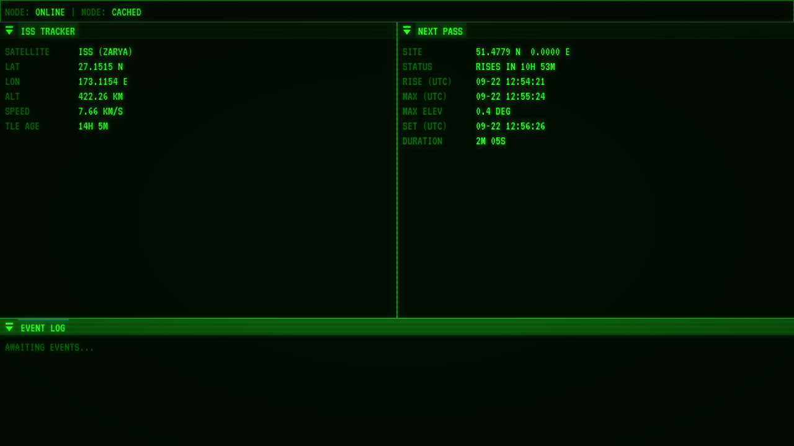

# A-T

A retro terminal-style satellite tracker, written in C++20 with OpenGL and Dear ImGui. It runs its own SGP4 orbit propagator, so positions come from the raw orbital elements and not from a third-party tracking API.



> **Status: in development.** The dashboard — tracker, pass predictor, event log, star map, system status, incoming transmission, lunar alignment, operating rules, CRT shader and header status — is assembled and working. Signal quality's data layer (fetching, caching and classifying the NOAA Kp index) is done, but it has no panel yet. The remaining status panels (that one, archive status, a relay queue, and the rest) are still to come. See [Roadmap](#roadmap).

## What works today

- **Live ISS tracker:** latitude, longitude, altitude and speed, recomputed every frame from the system clock, plus a TLE age indicator that turns amber after 3 days and red after 7.
- **Next pass panel:** for a fixed observer, the rise, peak and set times (UTC), the peak elevation, the pass length, and a live countdown. If a pass is already under way it shows when it sets.
- **Multiple tracked satellites:** every entry in the watchlist is loaded and kept live in the background; the SATELLITES panel picks which one the tracker, pass and ground track panels show.
- **Star map:** the real sky for the observer's location and time, from a filtered HYG Database catalog (naked-eye stars, magnitude 6.0 or brighter). Stars are sized and dimmed by magnitude, drawn in the dashboard's own phosphor green rather than their true spectral color to match the rest of the terminal look, with constellation stick-figure lines and labels for the brightest and best-known stars, both toggleable. Time controls let the sky be stepped, jumped, or played forward or backward at a chosen speed, independently of the live satellite tracker, with a one-click return to the current time.
- **Lunar alignment:** the Moon's phase name, illuminated fraction, age since the last new moon, and time until whichever of the next new or full moon comes first, computed from its own orbital elements rather than an ephemeris file or API. A manual snapshot, not continuously live: a REFRESH button and a REFRESHED timestamp show when it was last computed.
- **System status:** callsign, node ID, operating mode (`LIVE`/`CACHED`/`LOW-VISIBILITY`, worst-case across every watched satellite, not just the selected one), lifecycle state (`ONLINE`/`OFFLINE`) and last sync time, in the same label/value style as the tracker.
- **Incoming transmission:** a scrolling log of real events from the app's own pipeline (TLE fetches, propagator initialization, pass computations) across every watched satellite, separate from the per-satellite event log below. New lines type themselves in, one at a time, and a `PASSIVE MONITORING ENGAGED` heartbeat appears after a few minutes of quiet.
- **Event log:** logs real `SIGNAL ACQUIRED` / `SIGNAL LOST` transitions as the satellite rises and sets.
- **Operating rules:** a short, numbered, static list of station rules, read from a plain text file next to the executable; editing it and restarting picks up the change, no rebuild needed.
- **Header status:** `NODE: ONLINE` or `OFFLINE`, and `MODE: LIVE`, `CACHED` or `LOW-VISIBILITY`, reflecting whether the TLE came from the network, a fresh cache, or a stale one after a failed fetch.
- **Dockable dashboard:** the panels above are arranged with a real ImGui dockspace, so they can be dragged, resized and rearranged; your layout is remembered between runs.
- **CRT post-processing:** the picture is rendered to a texture and passed through scanline, glow and vignette shaders. Press **F2** in the running app to tune all three live and see the frame cost.
- **Orbital data:** the TLE comes from [Celestrak](https://celestrak.org/) and is cached on disk for two hours. If the network fails, the app falls back to a stale cached copy. With no network and no cache it still starts, and the panels show `NO DATA`.
- **Config file:** the observer's location and the watchlist are read from a plain text config file (`$XDG_CONFIG_HOME/a-t/config.txt`, or `~/.config/a-t/config.txt`) at startup, falling back to sane defaults (Greenwich, the ISS) if it is missing or a line in it can't be parsed.
- **Terminal look:** the VT323 pixel font, a green phosphor palette, and flat, square, minimal-border windows throughout.

## Planned

- **Satellites on the star map:** the tracked satellites overlaid on the star map as moving markers, so they can be seen against the same sky as the stars.
- **Signal quality panel:** the NOAA planetary Kp index is already fetched, cached (refreshed at most hourly; the index itself only updates every 3 hours) and classified into `STABLE`/`DEGRADED`/`DISRUPTED` — it just has no panel to show it in yet.
- **More panels:** a relay queue, archive status and a SQLite-backed archive.
- **Stretch:** SDP4 support for deep-space satellites.

## Building

Requires a C++20 compiler, CMake 3.20 or newer, and an OpenGL-capable desktop. It is developed on Linux (Debian on WSL2). macOS and Windows are untested.

On Debian or Ubuntu, install the system libraries first:

```sh
sudo apt install build-essential cmake pkg-config libcurl4-openssl-dev \
    libx11-dev libxrandr-dev libxinerama-dev libxcursor-dev libxi-dev libgl1-mesa-dev \
    libwayland-dev libxkbcommon-dev wayland-protocols
```

GLFW, glad, Dear ImGui, cpr and GoogleTest are downloaded by CMake with `FetchContent`, so nothing else needs installing.

```sh
cmake -B build
cmake --build build
./build/a-t
```

Run the tests with:

```sh
ctest --test-dir build --output-on-failure
```

The build copies `assets/` next to the executable, so it can be run from any directory. On startup the app prefers the X11 window backend, because under WSLg the Wayland backend draws no title bar or window buttons. It falls back to any other backend if X11 is unavailable.

## Design

The code is layered so that the astronomy has no dependency on the network or the UI:

- `src/core/` is the astronomy library: time utilities (Julian date, sidereal time), the TLE parser, the SGP4 propagator, coordinate transforms (TEME to ECEF to geodetic, equatorial to horizontal, and observer-relative azimuth and elevation), pass finding, the star catalog and constellation line loaders behind the star map, and the lunar phase and next-new/full-moon calculations behind the lunar alignment panel.
- `src/net/` fetches TLEs from Celestrak and the Kp index from NOAA SWPC, caches each on disk with its own refresh interval, and falls back to stale data on failure.
- `src/app/` joins the two: it loads a satellite, computes its position, plans passes, logs events (both per-satellite and the app's own internal pipeline), formats values for display, tracks the star map's own detachable clock, parses the config and operating rules files, and classifies the Kp index into a signal-quality tier.
- `src/ui/` is the GLFW, OpenGL and Dear ImGui front end: the style, the dockable dashboard, the panels (tracker, pass, ground track, star map, system status, incoming transmission, lunar alignment, operating rules, and the rest), and the CRT post-processing shaders.
- `assets/shaders/` holds the GLSL for the post-processing pass, loaded at runtime, so tuning an effect only needs a restart, not a rebuild.
- `tests/` is the GoogleTest suite.

## Verification

The propagator and the coordinate code are checked against independent references, not only against themselves:

- **SGP4:** positions and velocities match [python-sgp4](https://pypi.org/project/sgp4/) to within 1 mm across seven TLEs and times from a week before to a week after the epoch. The expected values were generated once offline and hardcoded. Vallado's published verification vectors for satellite 00005 are also checked.
- **Time and Kepler's equation:** worked examples from Meeus's *Astronomical Algorithms* and Vallado's textbook.
- **Coordinates:** reference points computed independently in high-precision arithmetic.
- **Passes:** rise, set and peak times agree with an independent calculation to within 0.02 s.
- **End to end:** on 2026-09-20 the ISS position agreed with the separate tracker at wheretheiss.at to 2.4 km, entirely along the direction of travel. That comparison is kept as an offline test.
- **Lunar phase:** illuminated fraction and age agree with the independent `pyephem` library to within about 1% and half a day across several reference dates, and with real eclipse times (an eclipse can only happen at an exact new or full moon) pulled from each event's own Wikipedia article. The next-new/next-full-moon search agrees with `pyephem` to within about 20 minutes.
- **Signal quality classification:** the `STABLE`/`DEGRADED`/`DISRUPTED` thresholds are checked against real Kp readings from the official GFZ Potsdam Kp index archive, for the well-documented May 2024 "Gannon storm" (the first G5-class geomagnetic storm since 2003) and a calm period beforehand.

## Limitations

- Only near-Earth satellites (orbital period under 225 minutes) are supported. Deep-space orbits need the SDP4 model, which is not implemented, and are rejected.
- Polar motion is ignored, and UT1 is taken to equal UTC. Both are far smaller than the error in the orbital elements themselves.
- Atmospheric refraction is not applied to elevations.
- SGP4 accuracy falls with the age of the TLE, by roughly 1 to 3 km per day for the ISS.
- The TLE is fetched before the window opens. With no network and no cache, startup can wait up to 5 seconds for the request to time out.

## Roadmap

Work is tracked as GitHub milestones, each split into small single-purpose issues:

| # | Milestone | Status |
|---|-----------|--------|
| 0 | Repo and scaffolding | Done |
| 1 | Window and rendering skeleton | Done |
| 2 | Visual style pass | Done |
| 3 | TLE data layer | Done |
| 4 | Core SGP4 propagator | Done |
| 5 | Live tracker panel | Done |
| 6 | Pass predictor panel | Done |
| 7 | Shader / post-processing pass | Done |
| 8 | Full dashboard assembly | Done |
| 9 | Stretch: multiple satellites, config file, ground track, CI tests, release packaging, SDP4 deep-space support | Mostly done (SDP4 still planned) |
| 10 | System readout | Done |
| 11 | Incoming transmission | Done |
| 12 | Lunar alignment | Done |
| 13 | Operating rules | Done |
| 14 | Signal quality | In progress (data layer done, no panel yet) |
| 15 | Relay queue | Planned |
| 16 | Event log (full: severity, ring buffer, persistence) | Planned |
| 17 | Archive status | Planned |
| 18 | Archives | Planned |
| — | Realistic star map | Done |

## Credits and data sources

- SGP4 model: Hoots and Roehrich, *Spacetrack Report No. 3* (1980), and Vallado, Crawford, Hujsak and Kelso, *Revisiting Spacetrack Report #3* (2006).
- Time and astronomy algorithms: Meeus, *Astronomical Algorithms*, and Vallado, *Fundamentals of Astrodynamics and Applications*.
- Orbital elements: [Celestrak](https://celestrak.org/).
- Reference tracker used for the end-to-end check: [wheretheiss.at](https://wheretheiss.at/).
- Star catalog: the [HYG Database](https://github.com/astronexus/HYG-Database), filtered to naked-eye stars (see `assets/stars/SOURCE.md`), under CC BY-SA 4.0.
- Constellation line data: extracted from [Stellarium](https://github.com/Stellarium/stellarium)'s `modern` sky culture (see `assets/stars/CONSTELLATION_LINES_SOURCE.md`), under GPL v2 or later.
- Space weather: the planetary Kp index from the [NOAA Space Weather Prediction Center](https://www.swpc.noaa.gov/); classification thresholds checked against the official [GFZ Potsdam Kp index archive](https://kp.gfz.de/) (CC BY 4.0), the definitive source NOAA's own feed derives from.
- Font: [VT323](https://fonts.google.com/specimen/VT323), under the SIL Open Font License (see `assets/fonts/OFL.txt`).
- Libraries: Dear ImGui, GLFW, glad, cpr, libcurl and GoogleTest.

## License

MIT. See [LICENSE](LICENSE). This covers the project's own source code only; the star and constellation data files under `assets/stars/` carry their own licenses (CC BY-SA 4.0 and GPL v2+ respectively — see [Credits and data sources](#credits-and-data-sources) and each file's own `SOURCE.md`).
